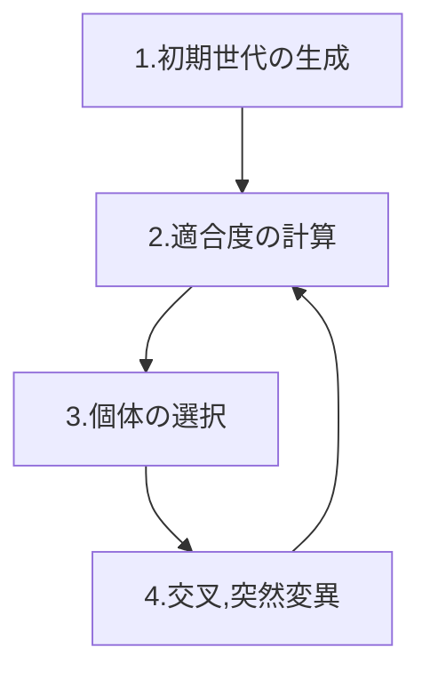

# 遺伝的アルゴリズムに関する記事

## はじめに
　遺伝的アルゴリズムとは、生物の進化からヒントを得た最適化のためのアルゴリズムの一種で、生物の進化を模倣して、問題に対する最適解を広い範囲で探索します。
従来の数学的な手法では解を求めることが困難であったり、通常の方法で解を探索しようとすると余りに時間がかかりすぎてしまう場合に役に立ちます。
　本記事では、遺伝的アルゴリズムの概要を述べた後に、遺伝的アルゴリズムと社会との関わりについて説明していきます。

## 遺伝的アルゴリズムの説明

### 遺伝的アルゴリズムの手順
遺伝的アルゴリズムがどのような手順で解を求めるのか概略を述べた後に、具体例を用いた説明をします。

遺伝的アルゴリズムは次の図のような手順により行われます。

それぞれの世代の個体数を$N$とします。

1 初期世代の生成
まずは$N$個の個体をランダムに生成し、$N$個の個体全体からなる集合「初期世代」を作成します。(最初の時点ではこの「初期世代」を「現世代」と呼びます。)

次の2~4の手順を繰り返すことで、「現世代」から次の世代を作り出します。

2 適合度の計算
それぞれの個体に対して評価関数を用いて、環境に適応している度合いを表す「適応度」の計算を行います。

3 選択
環境に適応した種は次の世代で個体を増やし、適応しない種は数を減らすように、「現世代」での個体から適合度の高い個体を選ぶ操作を行います。

4 交叉、突然変異
選択した個体に対して、「交叉」、「突然変異」といった操作を適用することで次の世代を作成し、新たに作成した世代を「現世代」として、古い世代と置き換えて2の操作に戻ります。

このように2から4の「適応度の評価」、「選択」、「交叉、突然変異」といった手順を「現世代」に対して適用することで次の世代を作成し、作成された世代が次の「現世代」となり、今度はこの新たな世代に対して、2~4の操作を適用して、また新たな世代を生成するという操作を繰り返していくことで、適合度の高い個体がより多くの子孫を残すことで徐々に集団全体が良くなっていくというのが遺伝的アルゴリズムの考え方になっています。(この手順のことを「世代交代」とよびます)

## 遺伝的アルゴリズムのメリット、デメリット
遺伝的アルゴリズムの従来の数学的な手法と比較した際のメリットについて説明をします。
### メリット 
- 様々な問題に対して適用することができる
　　従来の数学的な手法ではパラメータの数が多すぎて、適用するのが困難であった問題に対しても

### デメリット
- 

### 遺伝的アルゴリズムの応用例
「画像の復元」や「株取引エージェントの作成」といった問題に対して、パラメータを遺伝子に見立てることで遺伝的アルゴリズムを適用することができます。

### 

### 参考
- 橋本文彦「遺伝的アルゴリズムの基礎」
https://www.econ.osaka-cu.ac.jp/~hashimo/Genetic.pdf

- 
http://www.iba.t.u-tokyo.ac.jp/rs/ga.html

- 
https://www.jstage.jst.go.jp/article/jjsai/7/1/7_26/_pdf

- introduction to genetic algotithm
https://www.obitko.com/tutorials/genetic-algorithms/japanese/index.php

